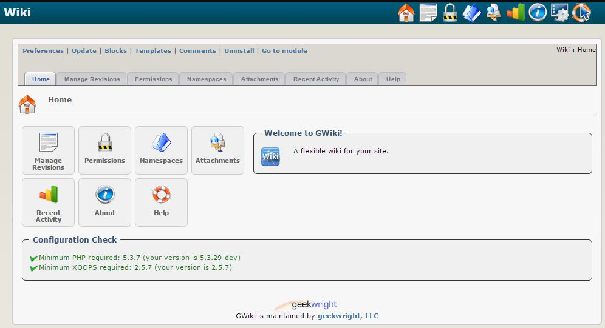

# Introduction

## Module [**gWiki**](https://github.com/geekwright/gwiki)

#### for XOOPS 2.5.7

### User Manual

© XOOPS Project \([www.xoops.org](https://xoops.org)\)

### Module Purpose

This module implements a Wiki based on the WikiCreole 1.0 specification. In addition to the basics as defined in the WikiCreole spec, the wiki features several powerful extensions, giving it great flexibility as a content authoring and presentation tool. It also features an equally flexible permission capability, making a single instance suitable for multiple collaborative efforts, each with their own policies.

 _Figure 1: Main view of the gWiki Module \(Admin side\)_

### Download/Fork the Module 

**You can fork the module --&gt;** [**here**](https://github.com/geekwright/gwiki)**\)**

### How to Contribute

[You can contribute on GitHub](https://github.com/XoopsDocs/gwiki-tutorial). Changes will be [pushed to Gitbook.io automatically](https://www.gitbook.com/book/xoops/gwiki-tutorial/activity) when the [main repository](https://github.com/XoopsDocs/gwiki-tutorial) changes.

Editing the book can be done either by updating the markdown files with a text editor, or opening the repository in [the Gitbook desktop app](https://github.com/GitbookIO/editor/blob/master/README.md). The desktop app will give you a live preview option.

## Table of Content

* [Install/Uninstall](install-uninstall.md)
* [Administration Menu](administration-menu.md)
* [Preferences](preferences.md)
* [Operating Instructions](operating-instructions.md)
* [The User Side](the-user-side/)
  * [Creating and Editing Pages](the-user-side/creating-and-editing-pages.md)
  * [Footnotes, Citations and References](the-user-side/footnotes-citations-and-references.md)
  * [Miscellaneous Directives](the-user-side/miscellaneous-directives.md)
  * [Related and Page Sets](the-user-side/related-and-page-sets.md)
  * [Text Decorations](the-user-side/text-decorations.md)
  * [Formatting](the-user-side/formatting.md)
  * [Boxes](the-user-side/boxes.md)
  * [Tables](the-user-side/tables.md)
  * [Links](the-user-side/links.md)
  * [Create Page Wizard ](the-user-side/create-page-wizard.md)
  * [Extras](the-user-side/extras.md)
* [Blocks](blocks.md)
* [Templates](templates.md)
* [Other](other.md) 
* [Module Credits](module-credits.md)
* [About XOOPS CMS](about-xoops-cms.md)

### License:

  
Unless specified, this content is licensed under a [Creative Commons Attribution-NonCommercial-ShareAlike 4.0 International License](http://creativecommons.org/licenses/by-nc-sa/4.0/).

All derivative works are to be attributed to XOOPS Project \([www.xoops.org](https://xoops.org)\)

