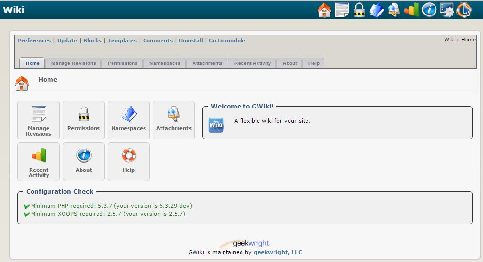

### _XOOPS Documentation Series_

# Module **[gWiki](https://github.com/geekwright/gwiki)** 
#### for XOOPS 2.5.7
      

            
## User Manual

© 2015 XOOPS Project ([www.xoops.org](http://xoops.org))    

## Module Purpose 

This module  implements a Wiki based on the WikiCreole 1.0 specification. In addition to the basics as defined in the WikiCreole spec, the wiki features several powerful extensions, giving it great flexibility as a content authoring and presentation tool. It also features an equally flexible permission capability, making a single instance suitable for multiple collaborative efforts, each with their own policies.

 **You can fork it--> [here](https://github.com/geekwright/gwiki))** 

*Figure 1: Main view of the gWiki Module (Admin side)*

# Table of Content

* [Install/Uninstall](book/1install.md)
* [Administration Menu](book/2administration.md)
* [Preferences](book/3preferences.md)
* [Operating Instructions](book/4operations.md)
* [The User Side](book/5userside.md)
    * [Creating and Editing Pages](book/5userside01.md)
    * [Footnotes, Citations and References](book/5userside02.md)
    * [Miscellaneous Directives](book/5userside03.md)
    * [Related and Page Sets](book/5userside04.md)
    * [Text Decorations](book/5userside05.md)
    * [Formatting](book/5userside06.md)
    * [Boxes](book/5userside07.md)
    * [Tables](book/5userside08.md)
    * [Links](book/5userside09.md)
    * [Create Page Wizard ](book/5userside10.md)
    * [Extras](book/5userside11.md)
* [Blocks](book/6blocks.md)
* [Templates](book/7templates.md)
* [Other](book/8other.md) 
* [Module Credits](book/9credits.md)
* [About XOOPS CMS](book/10aboutxoops.md)

##License:

 Unless specified, this content is licensed under a <a rel="license" href="http://creativecommons.org/licenses/by-nc-sa/4.0/">Creative Commons Attribution-NonCommercial-ShareAlike 4.0 International License</a>.

All derivative works are to be attributed to XOOPS Project ([www.xoops.org](http://xoops.org))
