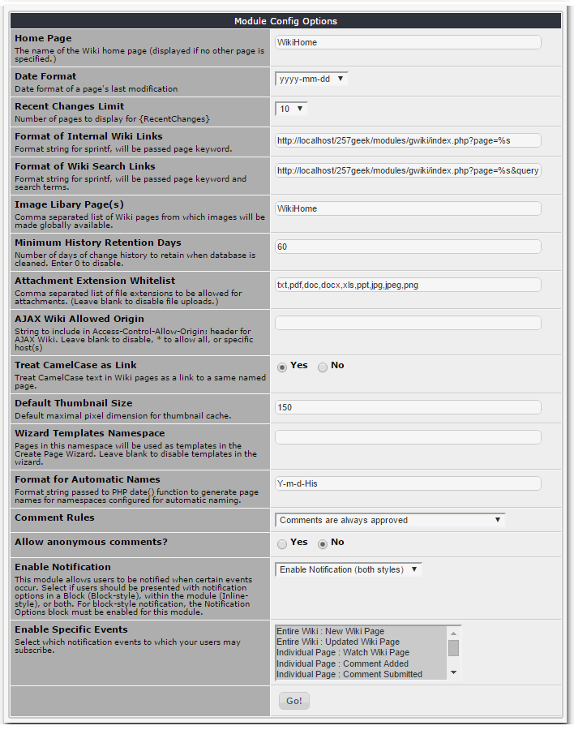

# 3.0 Preferences

###Home Page
The name of the Wiki home page. This is the page displayed if no other page is specified, such as on the initial entry to the wiki module.

###Date Format
Date format to use for dates displayed in the wiki, such as the last modified date shown in the wiki page footer.

###Recent Changes Limit
Number of pages to display in a {RecentChanges} list.

###Format of Internal Wiki Links
This is an sprintf() style formating string. It should expect one argument, the page name. This format string will be used to build links to other wiki pages under most circumstances. The default is appropriate for basic wiki use, but if you want to use URL rewriting, or the customizable wiki script from the extras folder, you may wish to specify an alternate format.

###Format of Wiki Search Links
This is an sprintf() style formating string. It should expect two arguments, the page name, and the search terms. This format string will be used by the search function to build links to matching wiki pages. The default is appropriate for basic wiki use, but if you want to use URL rewriting, or the customizable wiki script from the extras folder, you may wish to specify an alternate format.
Image Libary Page(s)
If you have stock images that you will need in multiple wiki pages, you may want to consider establishing an image library page, or pages, to make them globally available. This is simply a wiki page where images have been added using the image editor. What makes it different is being included in this list. This list establishes a search order to find an image if it isn't connected directly to the current page. Each library page will be searched in sequence for a named image. Multiple library pages can be specified as a comma separated list.
###Minimum History Retention Days
Number of days of change history to retain when database is cleaned. Enter 0 to completely disable cleaning.
###Attachment Extension Whitelist
Comma separated list of file extensions to be allowed for attachments. If left blank, file uploads will be disabled.

###AJAX Wiki Allowed Origin
String to include in Access-Control-Allow-Origin: header for AJAX Wiki. Leave blank to disable, * to allow all, or specific host(s)
Treat Camel Case as Link
Treat CamelCase text in Wiki pages as a link to a same named page. CamelCase, a series of words, each capitalized and joined together without spaces, is a traditional wiki convention. As wikis have matured, they have become less reliant on that tradition. Depending on your wiki's intended use, automatic linking of any CamelCase phrases can be undesirable. With this option, you can turn that automatic link making off.

###Default Thumbnail Size
This is the default maximal pixel dimension for generated thumbnail images. If a thumbnail is called for, and no size is specified, this value will be used.

###Wizard Templates Namespace
Pages in this namespace will be used as templates in the Create Page Wizard. Leave blank to disable templates in the wizard.

###Format for Automatic Names
Format string passed to PHP date() function to generate page names for namespaces configured for automatic naming.

###Comments and Notifications
The wiki supports XOOPS comments and notifications for wiki pages. All normal system options are supported. In addition, the wiki specific notification events are:
- Entire Wiki : New Wiki Page - Notify on creation of new pages only.
- Entire Wiki : Updated Wiki Page - Notify on any page updates (including new pages.)
- Individual Page : Watch Wiki Page - Notify on any updates of a specific page.
- Namespace : New Page in Namespace - Notify on creation of new pages in a specific namespace only.
- Namespace : Updated Page in Namespace - Notify on any page updates (including new pages) in a specific namespace.