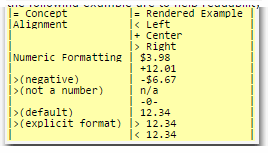
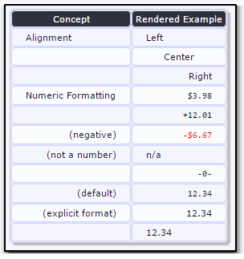

# 5.8 Tables

Tables cells are enclosed in vertical bars.
`|cell|`

| |
|----|
|cell|

The alignment and formatting in a cell can be modified with a format character following its opening bar. An "=" makes it a header cell, a ">" right aligns the content, a "<" left aligns it and a "+" centers it. The spaces and bar alignments in the following example are to help readability only; they are not required.

