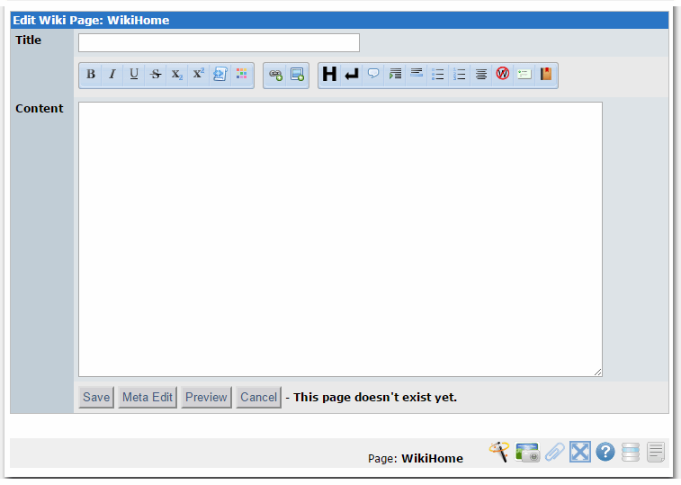

# The User Side

* [Creating and Editing Pages](https://github.com/xoops/gwiki-tutorial/tree/d66033909aa291e5c75bf230f90dc2676ae137ef/en/book/book/5userside01.md)
* [Footnotes, Citations and References](https://github.com/xoops/gwiki-tutorial/tree/d66033909aa291e5c75bf230f90dc2676ae137ef/en/book/book/5userside02.md)
* [Miscellaneous Directives](https://github.com/xoops/gwiki-tutorial/tree/d66033909aa291e5c75bf230f90dc2676ae137ef/en/book/book/5userside03.md)
* [Related and Page Sets](https://github.com/xoops/gwiki-tutorial/tree/d66033909aa291e5c75bf230f90dc2676ae137ef/en/book/book/5userside04.md)
* [Text Decorations](https://github.com/xoops/gwiki-tutorial/tree/d66033909aa291e5c75bf230f90dc2676ae137ef/en/book/book/5userside05.md)
* [Formatting](https://github.com/xoops/gwiki-tutorial/tree/d66033909aa291e5c75bf230f90dc2676ae137ef/en/book/book/5userside06.md)
* [Boxes](https://github.com/xoops/gwiki-tutorial/tree/d66033909aa291e5c75bf230f90dc2676ae137ef/en/book/book/5userside07.md)
* [Tables](https://github.com/xoops/gwiki-tutorial/tree/d66033909aa291e5c75bf230f90dc2676ae137ef/en/book/book/5userside08.md)
* [Links](https://github.com/xoops/gwiki-tutorial/tree/d66033909aa291e5c75bf230f90dc2676ae137ef/en/book/book/5userside09.md)
* [Create Page Wizard ](https://github.com/xoops/gwiki-tutorial/tree/d66033909aa291e5c75bf230f90dc2676ae137ef/en/book/book/5userside10.md)
* [Extras](https://github.com/xoops/gwiki-tutorial/tree/d66033909aa291e5c75bf230f90dc2676ae137ef/en/book/book/5userside11.md)

