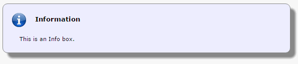
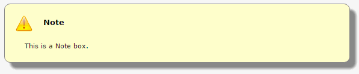
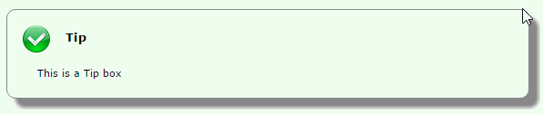
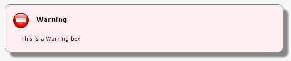
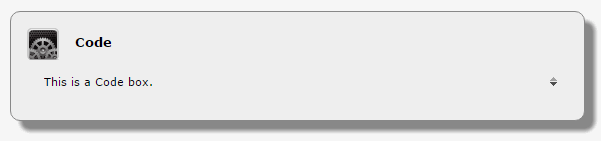
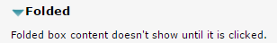
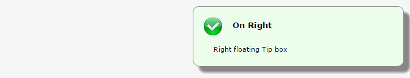
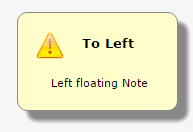

# Boxes

Boxes are containers that provide a visual highlight for their contents. All wiki boxes follow the following form:

`{type title}content{endtype}`

**Information**

`{info Information}This is an Info box.{endinfo}`

**Note**

`{note Note}`This is a Note box.`{endnote}`

**Tip**

`{tip Tip}`This is a Tip box`{endtip}`

_\*\*_Warning

`{warning Warning}`This is a Warning box`{endwarning}`

**Code**

The contents of a code box are shown as preformated text.

`{code Code}`This is a Code box.`{endcode}`

**Folded**

`{folded Folded}`Folded box content doesn't show until it is clicked.`{endfolded}`

**Box Modifiers**

Any box can accept a single modifier to set it to either side.

`{tip On Right|right}`Right floating Tip box`{endtip}`

`{note To Left|left}`Left floating Note`{endnote}`

