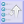

# Creating and Editing Pages

Initially, the wiki is empty. If you have the authority to create the home page, when you visit the wiki module, you will be presented with the wiki page editor for the home page, named WikiHome unless it has been changed in the module preferences.

## Page Names

Each wiki page is identified by a page name. That name can contain upper and lower case letters, numbers, and limited punctuation marks, periods \(.\) and dashes \(-\). In some cases, a page name can also contain a colon \(:\). The administrator can choose to recognize a CamelCase phrase in a wiki page as a page name.

## Creating a New Page

The easiest way to add a new page is to create a link to it in an existing page. Following that link \(to a page that does not exist\) will enter the page editor where you can enter and save the new page. For example, to create a page named "MyNewPage" you can add a link to it in an existing page, either as a link \[\[MyNewPage\]\], or if camel case is enabled, as MyNewPage. Save the edited page, then follow the link you just added. Also, the administrator can make a special New Page block available. Enter the page name in the block and choose Create to enter the editor.

## Namespaces

The module administrator can define special name spaces for the wiki. A page that belongs to a name space has the namespace followed by a colon \(:\) followed by a regular page name. Namespaces can have special properties, such as being inter-wiki links \(referring to pages on another wiki,\) having automatic naming, custom display templates or special permissions. If namespaces are active, any available namespaces for which you can create a new page will be shown in a selection list in the New Page block.

## Editing a Page

 If you can edit the displayed page, you will see the edit icon below the page content. Clicking the edit icon will take you to the page editor. The basic editor pane has Title and Content fields. Additional fields can be accessed using the Meta Edit button. Here is a description of editor fields.

**Editor Form Fields**

* Title - The page title
* Content - The page content
* Display Page Name - if specified, this will be shown instead of the page name when a link to the page is displayed.
* Parent Page - this can be specified to group pages as related. This relationship is shown using a Related Pages block.
* Page Set Home - if specified, this can group pages together as a page set. All pages with the same Page Set Home show special navigation buttons, allowing the reader to move between the pages \(like these Help pages.\)
* Page Set Order - this is the numeric order of the page in the set. If not specified \(or zero\) on save, the page will be put at the end of the page set.
* Meta Keywords - if specified, this will be used as the content for the HTML  tag.
* Meta Description - if specified, this will be used as the content for the HTML  tag.
* Show in Index Listings - if Yes the page will be included in index lists.
* Leave Inactive on Save - if Yes the page will be left inactive when saved. The wiki saves each version of a page, and normally it will make the new version active when saved. Sometimes, this is not desired \(for example, edits are not complete, or the page needs to be made available at a future point in time.\) The page history tool can be used to further edit or activate the page when saved with this set to No.

**Editor Toolbar**

The Editor Toolbar assists entering wiki markup. You can click an icon to insert the related markup into the page, and the cursor will be positioned ready to enter the text you want the markup applied to. You can also select text to apply the markup to in the editor, and then click the icon. If more information is needed to build the markup, a popup form will be presented to enter the information. The available markup assists are:

**Text Decoratation**

* Bold
* Italic
* Underline
* Strike Through
* Subscript
* Superscript
* Monospaced
* Colors

**URL's**

* Link
* Image Url

**Formatting**

* Header
* Line Break
* Block Quote
* Indent
* Horizontal Rule
* Bullet List Item
* Numbered List Item
* Centered
* No Wiki
* Boxes
* Reference

**Editor Form Buttons**

* Save - Save the page currently in the editor as a new revision.
* Meta Edit - Switch editor display to meta data pane
* Page Edit - Switch editor display to basic \(title and contents\) pane
* Preview - Display a preview of the page currently in the editor without saving to continue editing.
* Cancel - Cancel editing, discarding any unsaved changes

**Editor Icons**

Here is a list of other icons shown in the page editor and their meanings.

*  Invoke the Create Page Wizard to assist in creating a new wiki page. This only shows when Content is empty.
*  Invokes a special function to reorder pages in a page set.
*  Invokes the Image editor.
*  Invokes the File Attachment editor.
*  Enters Full Screen mode, where a maximum amount of browser display space is used for the editable page contents.
*  Opens a set of quick reference help pages describing wiki markup.
*  You can use the history tool to view or restore prior versions of a page. Each time a page is updated, a new version of the page is saved. Any old versions still exist, but are now inactive.
*  Displays the page source a text.
*  Closes extra editor function windows.

**History**

 The history tool can be accessed from the page information area both in the editor and the normal page views. The history tool provides a list of all the revisions of the page still tracked in the wiki. The following options are available:

* View - Click on a page title to display a revision in the View pane.
* Compare - Select this option to display a revision in the Compare pane.
* Restore - Select this option to make the revision the active revision.
* Edit - This option enters the page editor with the selected revision.
* Diff - Select this option to show a diff view of the active revision against the selected revision.
* Below the View and Compare panes is a Diff button which compares the revisions currently shown in the view and compare panes.

