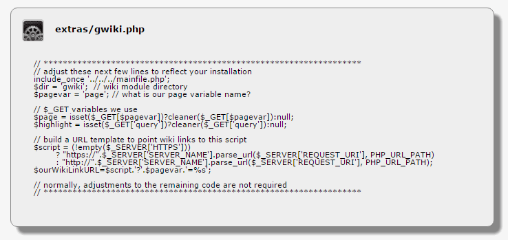

# Extras

Extras

## Wiki Page Anywhere

**call it anything, put it anywhere**

In the modules/gwiki/extras folder of the distribution, there is a customizable wiki script called gwiki.php. It can be used to put the wiki content exactly where you need it. At the head of the script you will find the most needed customizations. Start by placing the script where you want to call it, and give it the name you want it to have. The next critical step is to adjust the include\_once line to locate your XOOPS installation's mainfile.php. You can also adjust what the wiki module directory is called, what variable carries the page name.

Of course, more extensive modifications can be made if needed, but for most uses, all you will need to consider modifying is the following block of code:

## FBComments Integration

The wiki includes a FBComments plugin script to provide enhanced Open Graph data for sharing wiki content through Facebook® for implementations using the FBComments module. Values for the following meta tags are provided:

* og:url - a canonical URL for the page is provided
* og:title - the wiki page Title will be used
* og:description - the Meta Description for the page will be used if specified, otherwise the initial text of the page will be used.
* og:image - if an image defined for the page is marked Use this image to represent the page, that image will be used

